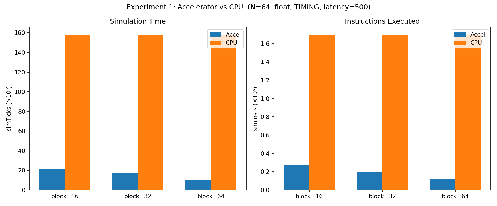
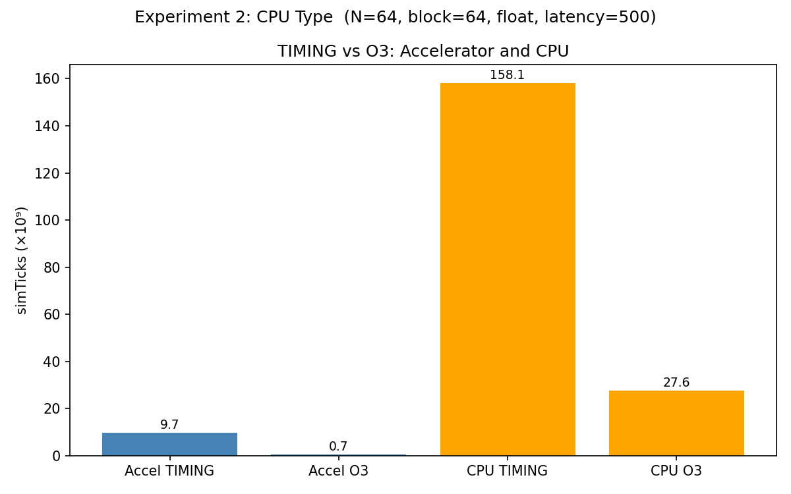
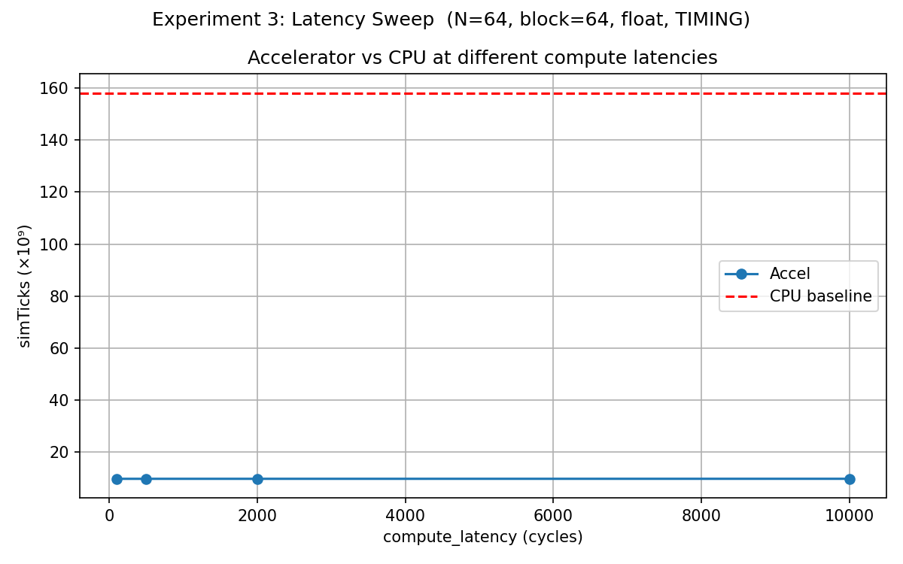
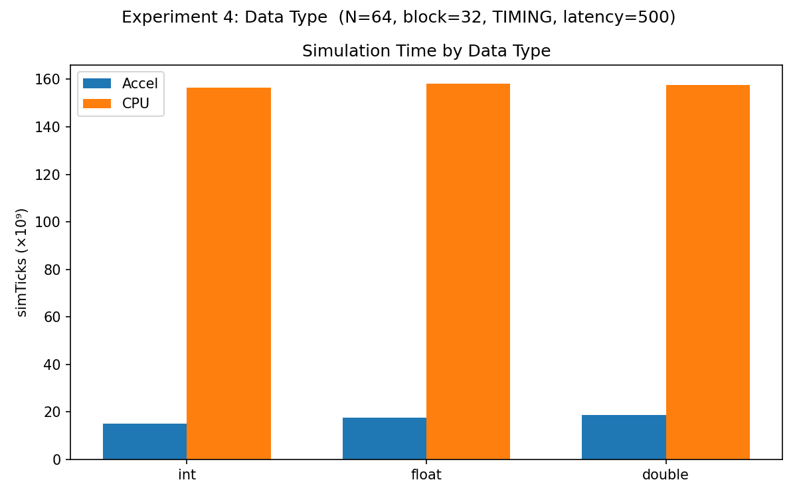
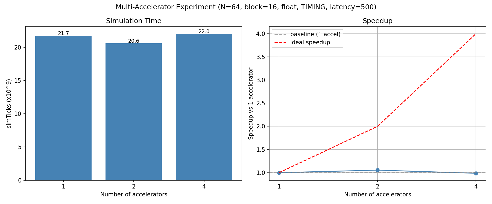

# Matrix Accelerator Experiments

## Setup

- gem5 SE mode, RISC-V
- Matrix size: N=64
- CPU: TIMING (in-order) unless stated otherwise
- Memory: SingleChannelDDR4_2400, no cache
- Accelerator: DMA-based MatrixAccel (DmaVirtDevice)
- Test program: blocked matrix multiply, A×B=C, B=identity → verify C==A

---

## Experiment 1: Accelerator vs CPU, block size sweep

**Goal:** Compare simulation time with and without accelerator for different block sizes.

**Configuration:** TIMING CPU, float, compute_latency=500, block=16/32/64

**Expected:** Accelerator faster than CPU. Larger block = fewer accelerator calls = less overhead.

**Results:**

| Mode  | Block | simTicks     |
|-------|-------|--------------|
| Accel | 16    | 20 820 914 000 |
| Accel | 32    | 17 512 680 000 |
| Accel | 64    | 9 736 855 000  |
| CPU   | 16    | 158 100 009 000 |
| CPU   | 32    | 158 100 009 000 |
| CPU   | 64    | 158 100 009 000 |

**Conclusion:** Accelerator is faster at all block sizes. At block=64 the speedup is ~16×.
CPU time does not depend on block size because it does not use blocking — it computes the full matrix with a single triple loop without splitting into blocks.
Larger blocks reduce the number of accelerator calls (P³ = (N/block)³), which reduces DMA overhead and improves performance.

---

## Experiment 2: TIMING vs O3 CPU

**Goal:** Check how out-of-order CPU affects performance with and without accelerator.

**Configuration:** block=64, float, compute_latency=500

**Expected:** O3 faster than TIMING for both modes.
Accelerator benefits less because DMA transfer is the bottleneck, not CPU instruction execution.

**Results:**

| Mode        | simTicks       |
|-------------|----------------|
| Accel TIMING | 9 736 855 000 |
| Accel O3     | 657 462 000 |
| CPU TIMING   | 158 100 009 000 |
| CPU O3       | 27 615 351 000 |

**Conclusion:** O3 significantly speeds up both modes. With accelerator, O3 reduces the CPU overhead (buffer copying, MMIO register writes, polling loop).
The speedup of accelerator over CPU is even larger with O3 (~42×) than with TIMING (~16×).

---

## Experiment 3: Compute latency sweep

**Goal:** Check how accelerator compute latency affects simulation time.

**Configuration:** TIMING CPU, block=64, float, latency=100/500/2000/10000

**Expected:** Simulation time should grow with latency, but slowly — DMA transfer time dominates over compute time.

**Results:**

| Latency (cycles) | simTicks       |
|------------------|----------------|
| 100              | 9 736 665 000  |
| 500              | 9 736 855 000  |
| 2000             | 9 738 928 000  |
| 10000            | 9 747 016 000  |

**Conclusion:** Simulation time barely changes across a 100× range of compute latency.
The bottleneck is memory bandwidth (DMA transfer), not the accelerator compute unit.
This means that optimizing the compute logic gives almost no benefit — the system is memory-bound.

---

## Experiment 4: Data type comparison

**Goal:** Compare performance for int, float, and double data types.

**Configuration:** TIMING CPU, block=32, compute_latency=500

**Expected:** int < float < double for accelerator (element size affects DMA volume).
CPU time should also grow slightly with element size.

**Results:**

| Mode  | Type   | simTicks       |
|-------|--------|----------------|
| Accel | int    | 15 058 495 000 |
| Accel | float  | 17 512 680 000 |
| Accel | double | 18 821 875 000 |
| CPU   | int    | 156 616 041 000 |
| CPU   | float  | 158 100 009 000 |
| CPU   | double | 157 636 601 000 |

**Conclusion:** Int is faster than float despite the same element size (4 bytes) — integer multiplication requires fewer cycles than floating point multiplication.
Double is slower than float for two reasons: twice the DMA volume (8 bytes vs 4) with roughly the same computational cost per operation.
CPU time is almost unchanged — memory access count is the same regardless of element size.

---

## Experiment 5: Multiple accelerators

**Goal:** Check whether adding more accelerators in parallel reduces simulation time.

**Configuration:** TIMING CPU, block=16, float, compute_latency=500, num_accels=1/2/4.
Queue-based dispatch: CPU monitors all accelerators and assigns the next block as soon as one becomes free.

**Expected:** Ideally N accelerators → N× speedup. In practice limited by shared memory bus.

**Results:**

| Num accels | simTicks       | Speedup vs 1 |
|------------|----------------|--------------|
| 1          | 21 742 725 000 | 1.00×        |
| 2          | 20 612 560 000 | 1.05×        |
| 4          | 22 017 486 000 | 0.99×        |

**Conclusion:** Adding more accelerators gives no speedup. All accelerators share the same SingleChannelDDR4_2400 memory bus, which is already saturated by a single accelerator. Additional accelerators only create contention on the bus.
This confirms the conclusion from Experiment 3: the system is memory-bound, not compute-bound. To benefit from multiple accelerators, each would need its own dedicated memory channel.
