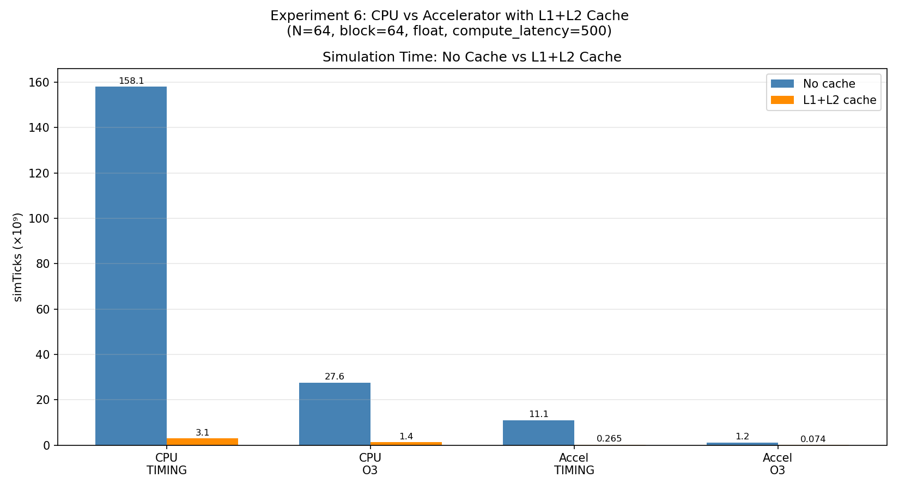
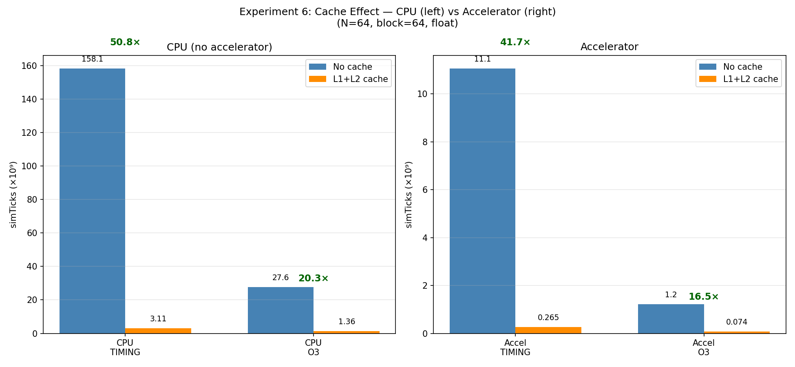
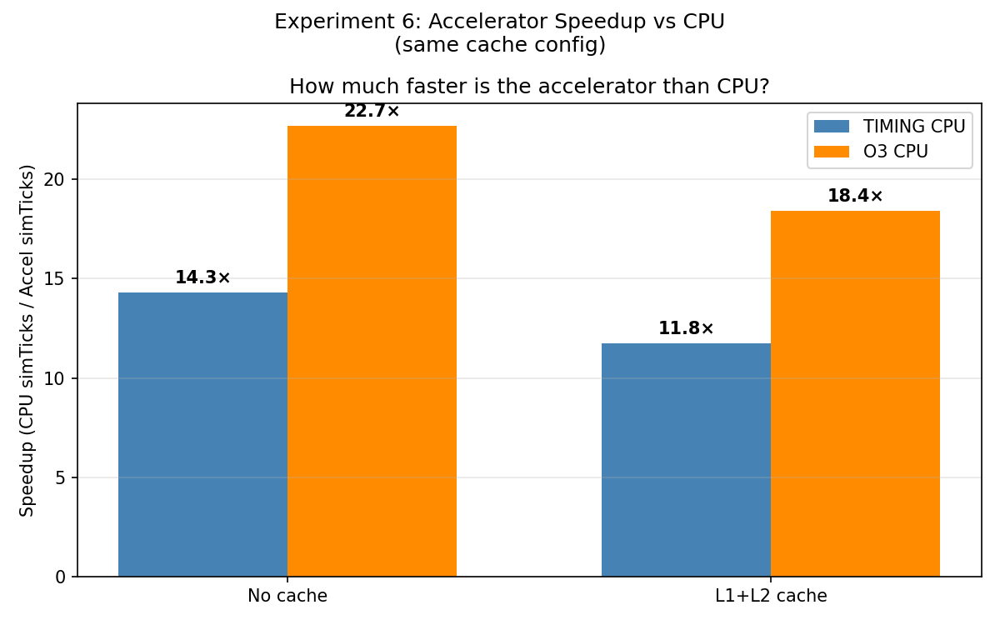
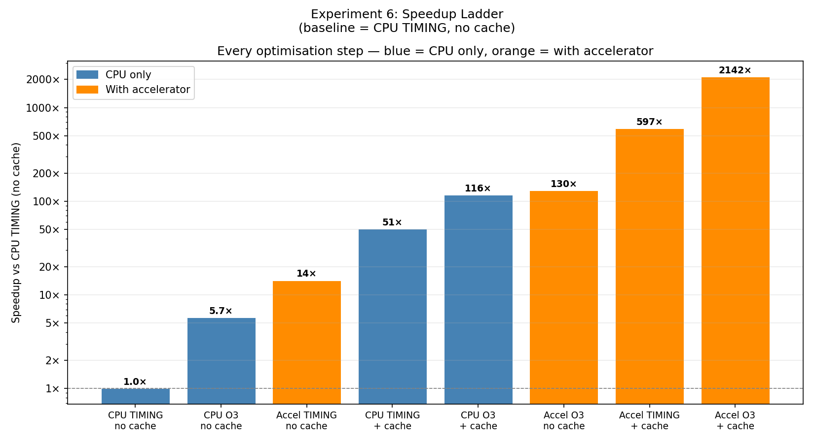
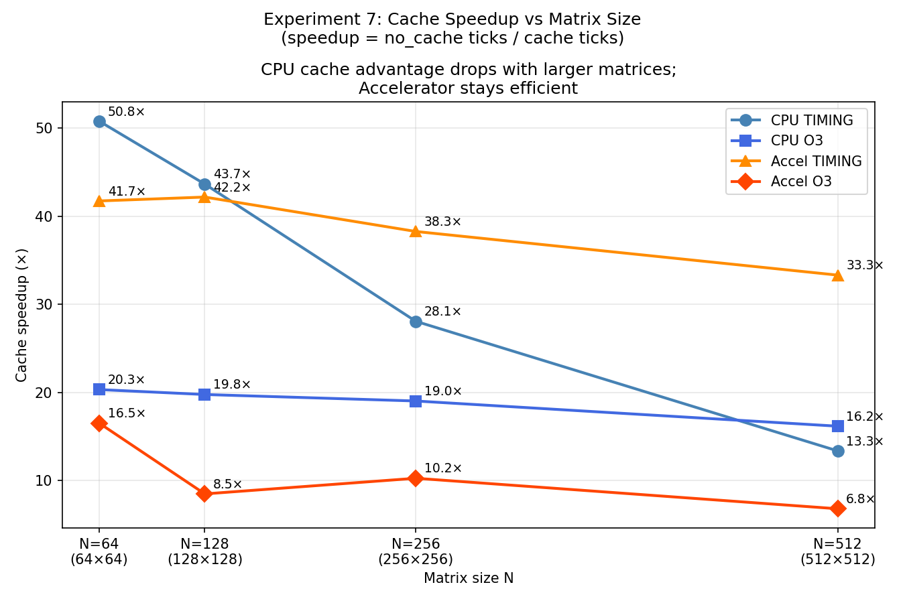
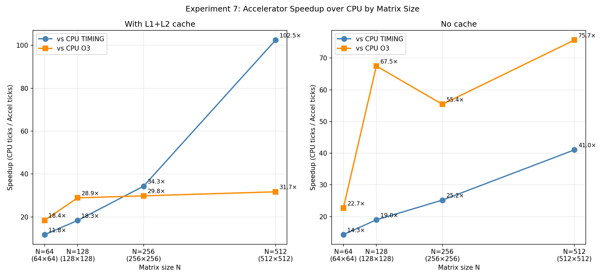
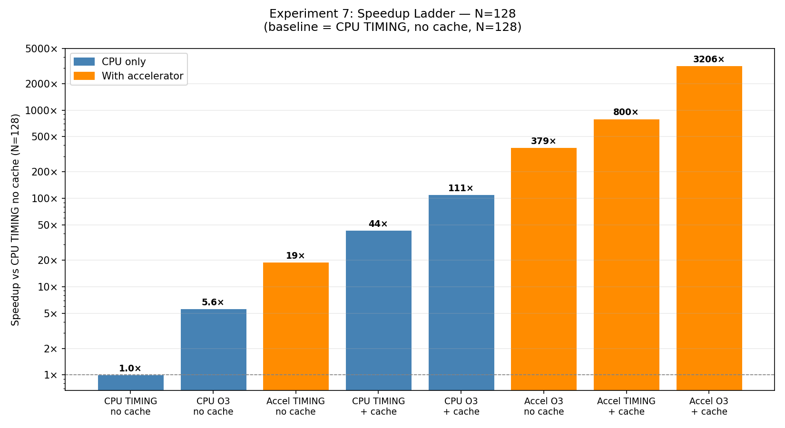

# Эксперименты с матричным акселератором

## Конфигурация стенда

- gem5, режим SE (Syscall Emulation), архитектура RISC-V
- Размер матрицы: N=64
- CPU: TIMING (in-order), если не указано иначе
- Память: SingleChannelDDR4_2400, кэш отсутствует
- Акселератор: MatrixAccel на базе DmaVirtDevice
- Тестовая программа: блочное матричное умножение A×B=C, B=единичная → проверка C==A

---

## Эксперимент 1: Акселератор vs CPU, sweep по размеру блока

**Цель:** Сравнить время симуляции с акселератором и без при разных размерах блока.

**Конфигурация:** TIMING CPU, float, compute_latency=500, block=16/32/64

**Ожидание:** Акселератор быстрее CPU. Больший блок — меньше вызовов акселератора — меньше накладных расходов.

**Результаты:**

| Режим | Блок | simTicks |
|-------|------|----------|
| Accel | 16   | 20 820 914 000 |
| Accel | 32   | 17 512 680 000 |
| Accel | 64   | 9 736 855 000  |
| CPU   | 16   | 158 100 009 000 |
| CPU   | 32   | 158 100 009 000 |
| CPU   | 64   | 158 100 009 000 |


**Вывод:** Акселератор быстрее CPU при всех размерах блока. При block=64 ускорение ~16×.
Время CPU не зависит от размера блока — CPU вычисляет всю матрицу одним тройным циклом без разделения на блоки.
Больший блок уменьшает число вызовов акселератора (P³ = (N/block)³), что снижает накладные расходы на DMA и улучшает производительность.

---

## Эксперимент 2: Сравнение TIMING и O3 CPU

**Цель:** Проверить как суперскалярный процессор (O3) влияет на производительность с акселератором и без.

**Конфигурация:** block=64, float, compute_latency=500

**Ожидание:** O3 быстрее TIMING в обоих режимах.
Акселератор выигрывает меньше, так как узкое место — DMA-передача, а не исполнение инструкций CPU.

**Результаты:**

| Режим        | simTicks |
|--------------|----------|
| Accel TIMING | 9 736 855 000 |
| Accel O3     | 657 462 000 |
| CPU TIMING   | 158 100 009 000 |
| CPU O3       | 27 615 351 000 |


**Вывод:** O3 значительно ускоряет оба режима. С акселератором O3 сокращает накладные расходы CPU:
копирование буферов, запись в MMIO регистры, цикл опроса статуса.
Ускорение акселератора относительно CPU ещё больше с O3 (~42×), чем с TIMING (~16×).

---

## Эксперимент 3: Sweep по задержке вычисления

**Цель:** Проверить как задержка compute_latency акселератора влияет на время симуляции.

**Конфигурация:** TIMING CPU, block=64, float, latency=100/500/2000/10000

**Ожидание:** Время симуляции должно расти с задержкой, но медленно —
время DMA-передачи доминирует над временем вычисления.

**Результаты:**

| Задержка (циклы) | simTicks |
|------------------|----------|
| 100              | 9 736 665 000 |
| 500              | 9 736 855 000 |
| 2000             | 9 738 928 000 |
| 10000            | 9 747 016 000 |


**Вывод:** Время симуляции почти не меняется при изменении задержки в 100 раз.
Узкое место — пропускная способность памяти (DMA-передача), а не вычислительный блок акселератора.
Оптимизация логики вычисления практически не даёт эффекта — система ограничена памятью.

---

## Эксперимент 4: Сравнение типов данных

**Цель:** Сравнить производительность для типов int, float и double.

**Конфигурация:** TIMING CPU, block=32, compute_latency=500

**Ожидание:** Для акселератора int < float < double (размер элемента влияет на объём DMA).
Время CPU изменяется незначительно.

**Результаты:**

| Режим | Тип    | simTicks |
|-------|--------|----------|
| Accel | int    | 15 058 495 000 |
| Accel | float  | 17 512 680 000 |
| Accel | double | 18 821 875 000 |
| CPU   | int    | 156 616 041 000 |
| CPU   | float  | 158 100 009 000 |
| CPU   | double | 157 636 601 000 |


**Вывод:** Int быстрее float несмотря на одинаковый размер элемента (4 байта) — целочисленное умножение требует меньше тактов чем умножение с плавающей точкой.
Double медленнее float по двум причинам: вдвое больший объём DMA (8 байт против 4) при примерно одинаковой трудоёмкости операции умножения.
Время CPU почти не меняется — число обращений в память одинаково вне зависимости от типа данных.

---

## Эксперимент 5: Несколько акселераторов

**Цель:** Проверить ускоряет ли добавление нескольких параллельных акселераторов время симуляции.

**Конфигурация:** TIMING CPU, block=16, float, compute_latency=500, num_accels=1/2/4.
Диспетчеризация через очередь: CPU следит за всеми акселераторами и назначает
следующий блок как только один освобождается.

**Ожидание:** В идеале N акселераторов → N× ускорение.
На практике ожидаем ограничение из-за общей шины памяти.

**Результаты:**

| Число акселераторов | simTicks | Ускорение |
|---------------------|----------|-----------|
| 1                   | 21 742 725 000 | 1.00× |
| 2                   | 20 612 560 000 | 1.05× |
| 4                   | 22 017 486 000 | 0.99× |


**Вывод:** Добавление акселераторов не даёт ускорения. Все акселераторы используют
одну шину памяти SingleChannelDDR4_2400, которая насыщена уже одним акселератором.
Дополнительные акселераторы только создают конкуренцию за шину.
Это подтверждает вывод эксперимента 3: система ограничена памятью, а не вычислениями.
Для реального ускорения каждому акселератору нужен отдельный канал памяти.

---

### Детальный анализ: почему параллельные акселераторы не работают

#### Механизм арбитрации в SystemXBar

Изучение исходного кода gem5 (`src/mem/xbar.cc`, `src/mem/coherent_xbar.cc`) показало точный механизм, объясняющий результат эксперимента.

SystemXBar использует **FCFS-арбитрацию (first-come, first-served)** через объект `Layer`. На каждый порт памяти существует ровно **один `reqLayer`** — очередь типа `std::deque`, через которую все запросы проходят строго последовательно:

```
Время 0:   DMA запрос Accel 0 → занимает reqLayer на 16+ циклов
Время 17:  DMA запрос Accel 1 → ожидает в очереди
Время 35:  DMA запрос Accel 2 → ожидает в очереди
Время 54:  DMA запрос Accel 3 → ожидает в очереди
```

При ширине шины `width=16` байт (128 бит) один пакет на 256 байт занимает layer на `ceil(256/16) = 16` тактов плюс накладные расходы на заголовок. Пока один акселератор занимает layer — остальные три стоят в очереди. Никакого параллелизма нет.

#### Дополнительный overhead: CoherentXBar и snoop-фильтр

Текущий конфиг подключает акселераторы к `SystemXBar` — это `CoherentXBar`, который обрабатывает каждый запрос через snoop-фильтр (~300 строк кода на запрос):

- lookup в snoop-фильтре: +1 такт на каждый запрос
- snoop broadcast: рассылка всем портам CPU для поддержки когерентности кэша
- отслеживание `outstandingSnoop` и `routeTo` карты

Акселератор не участвует в когерентности кэша — он просто читает данные из памяти. Весь этот механизм для него избыточен, но overhead присутствует. Для DMA-акселераторов правильнее использовать `NoncoherentXBar` (`IOXBar`), у которого нет snoop-логики (~75 строк на запрос) и нет snoop-слоёв.

#### Что означает "несколько каналов памяти" в gem5

`DualChannelDDR4_2400` (доступен в `gem5.components.memory.multi_channel`) — это не отдельная шина, а два объекта `MemCtrl` с address interleaving, оба подключённые к **одному SystemXBar**:

```
Accel 0 ──┐
Accel 1 ──┤→ SystemXBar (один reqLayer) → MemCtrl 0 → DDR канал 0
Accel 2 ──┤                            → MemCtrl 1 → DDR канал 1
Accel 3 ──┘
```

Двойной канал увеличил бы пропускную способность DDR в 2×, но узкое место — сама шина SystemXBar и её единственный reqLayer. Сериализация запросов останется.

#### Что реально устранило бы конкуренцию

Для подлинной параллельной работы N акселераторов необходима отдельная топология — свой XBar и свой MemCtrl на каждый акселератор:

```
CPU → L1/L2 → SystemXBar → MemCtrl → DDR  (основная память)

Accel 0 → XBar_0 → MemCtrl_0 → DDR_0  (выделенная память)
Accel 1 → XBar_1 → MemCtrl_1 → DDR_1
```

Это не параметр конфига, а изменение топологии. Кроме того, при такой схеме CPU не имеет прямого доступа к памяти акселераторов — необходим явный этап копирования данных перед вычислением.

#### Архитектурный контекст: когерентный акселератор vs GPU

Реализованный акселератор относится к классу **когерентных акселераторов** (shared memory): он разделяет единое адресное пространство с CPU, что исключает необходимость явного копирования данных. Это упрощает программирование, но создаёт конкуренцию за шину памяти.

GPU решает задачу масштабирования иначе — через **выделенную высокоскоростную память** (HBM, ~3000 GB/s против ~25 GB/s у DDR4) и явное копирование данных из CPU в GPU память перед вычислением (`cudaMemcpy`). Накладные расходы на копирование оправданы для больших задач, где объём вычислений (O(n³)) значительно превышает объём передаваемых данных (O(n²)).

| Характеристика | Реализованный акселератор | GPU |
|---|---|---|
| Память | общая с CPU | выделенная VRAM/HBM |
| Копирование данных | не требуется | явное |
| Конкуренция за шину | есть | нет (собственная шина) |
| Масштабирование | ограничено шиной | линейное по числу SM |
| Сложность | низкая | высокая |

Акселератор является строительным блоком GPU-концепции: GPU представляет собой набор вычислительных блоков (аналогичных акселератору) с выделенной памятью и специализированным высокоскоростным interconnect'ом.

---

## Эксперимент 6: Акселератор с иерархией кэша L1+L2

**Цель:** Проверить насколько кэш улучшает производительность акселератора и CPU.
Выполнить более реалистичные измерения (рекомендация ментора: O3 + кэш).

**Конфигурация:** block=64, float, compute_latency=500.
Кэш: PrivateL1PrivateL2CacheHierarchy (32KiB L1D, 32KiB L1I, 256KiB L2), DDR4_2400.
Без кэша: NoCache (для сравнения используются результаты экспериментов 1–2).

**Технические проблемы и решения:**

Для корректной работы акселератора с кэшем потребовалось решить две проблемы:

1. **Polling STATUS через кэш (бесконечный цикл):**
   Первое чтение регистра STATUS (0x50000000) → L1D кэширует STATUS=0.
   Акселератор устанавливает STATUS=1 напрямую — L1D не знает.
   CPU вечно читает STATUS=0 из кэша.
   *Решение:* в `src/arch/riscv/tlb.cc` (SE-ветка) после `req->setPaddr()`:
   ```cpp
   if (paddr >= 0x50000000 && paddr < 0x54000000)
       req->setFlags(Request::UNCACHEABLE | Request::STRICT_ORDER);
   ```

2. **DMA запись в кэшированный буфер (паника cache.cc:1225):**
   CPU записывает buf_c → Modified строки в L1/L2.
   DMA пишет в тот же адрес без предварительного invalidate → паника:
   "l1d-cache-0 is passing a Modified line through WriteReq, but keeping the block"
   *Решение:* подключить DMA акселератора через IOXBar + IOCache (1KiB):
   ```
   accel.dma → IOXBar → IOCache → membus → snoops → L1/L2 → DDR
   ```
   IOCache генерирует snoop-запросы, вынуждая L1/L2 сбросить Modified строки перед DMA записью.
   Реализовано вручную в `run_experiment.py` (SimpleBoard в SE режиме не поддерживает iobus автоматически).

**Результаты:**

| Конфигурация | simTicks | Ускорение от кэша |
|---|---|---|
| CPU TIMING, no cache | 158 100 009 000 | — |
| CPU TIMING + cache | 3 112 031 000 | ~51× |
| CPU O3, no cache | 27 615 351 000 | — |
| CPU O3 + cache | 1 359 306 000 | ~20× |
| Accel TIMING, no cache | 9 736 855 000 | — |
| Accel TIMING + cache | 264 821 000 | ~37× |
| Accel O3, no cache | 657 462 000 | — |
| Accel O3 + cache | 73 796 000 | ~9× |

**Ускорение акселератора vs CPU при одинаковой конфигурации кэша:**

| Конфигурация | CPU simTicks | Accel simTicks | Ускорение акселератора |
|---|---|---|---|
| TIMING + cache | 3 112 031 000 | 264 821 000 | ~11.7× |
| O3 + cache | 1 359 306 000 | 73 796 000 | ~18.4× |

**Вывод:**

Кэш даёт огромное ускорение как для CPU, так и для акселератора. CPU выигрывает
больше всего с TIMING (~51×) — матрицы A, B, C (16 KiB каждая, итого 48 KiB) почти полностью
помещаются в L1D (32 KiB), что устраняет подавляющее большинство обращений к DDR.

Акселератор тоже выигрывает от кэша (~37× для TIMING): CPU копирует блоки из A и B в buf_a/buf_b
через кэш — повторные блоки попадают в L1D. DMA читает buf_a/buf_b через IOCache,
который снупит L1 и возвращает данные напрямую из кэша. Это резко сокращает число обращений к DDR.

Сравнение акселератора с CPU при наличии кэша показывает, что акселератор сохраняет
преимущество: ~11.7× (TIMING) и ~18.4× (O3). При O3+cache разрыв больше, поскольку
O3 эффективнее переупорядочивает накладные расходы CPU (копирование буферов, polling),
но не может ускорить саму DMA-передачу — это по-прежнему задача акселератора.









---

## Эксперимент 7: Масштабирование по размеру матрицы

**Цель:** Проверить как меняется преимущество акселератора при росте размера задачи.
Гипотеза: при больших матрицах кэш перестаёт помогать CPU, а акселератор остаётся эффективным.

**Конфигурация:** block=64, float, compute_latency=500.
Размеры матриц: N=64 (16 KiB), N=128 (64 KiB), N=256 (256 KiB), N=512 (1 MiB).
Для сравнения — L1D=32 KiB, L2=256 KiB.

| N | Размер матрицы | Три матрицы | Помещается в |
|---|---|---|---|
| 64  | 16 KiB  | 48 KiB  | L1D (32 KiB) почти полностью |
| 128 | 64 KiB  | 192 KiB | L2 (256 KiB) |
| 256 | 256 KiB | 768 KiB | не в L2 |
| 512 | 1 MiB   | 3 MiB   | не в L2 |

**Результаты:**

| Конфигурация | N=64 | N=128 | N=256 | N=512 |
|---|---|---|---|---|
| CPU TIMING, no cache | 158.1B | 1222.2B | 9703.6B | 91030.3B |
| CPU TIMING + cache   | 3.1B   | 28.0B   | 345.6B  | 6821.6B  |
| CPU O3, no cache     | 27.6B  | 217.7B  | 1791.2B | 14089.8B |
| CPU O3 + cache       | 1.36B  | 11.0B   | 94.2B   | 872.1B   |
| Accel TIMING, no cache | 11.1B | 64.4B  | 385.2B  | 2218.1B  |
| Accel TIMING + cache   | 0.265B | 1.53B | 10.1B   | 66.6B    |
| Accel O3, no cache     | 1.22B  | 3.23B | 32.3B   | 186.2B   |
| Accel O3 + cache       | 0.074B | 0.381B | 3.16B  | 27.5B    |

*(все значения в миллиардах тиков)*

**Ускорение акселератора vs CPU (с кэшем):**

| N | vs CPU TIMING | vs CPU O3 |
|---|---|---|
| 64  | 11.8× | 18.4× |
| 128 | 18.3× | 28.9× |
| 256 | 34.3× | 29.8× |
| 512 | **102.5×** | 31.7× |

**Ускорение от кэша (no_cache / cache):**

| Конфигурация | N=64 | N=128 | N=256 | N=512 |
|---|---|---|---|---|
| CPU TIMING  | 50.8× | 43.7× | 28.1× | 13.3× |
| CPU O3      | 20.3× | 19.8× | 19.0× | 16.2× |
| Accel TIMING | 41.7× | 42.2× | 38.3× | 33.3× |
| Accel O3    | 16.5× | 8.5×  | 10.2× | 6.8×  |

**Вывод:**

Преимущество акселератора растёт с размером матрицы. При N=512 с кэшем акселератор
быстрее CPU TIMING в **102.5×**. Это объясняется тем, что при больших матрицах (>L2)
CPU TIMING не может скрыть задержки промахов в L2 — каждый промах ждёт полной задержки
DDR. Акселератор через IOCache по-прежнему работает эффективно.

CPU O3 лучше переносит рост матрицы за счёт out-of-order скрытия задержек памяти,
поэтому ускорение акселератора vs CPU O3 стабилизируется на ~30× при N≥256.

Ускорение от кэша у акселератора (Accel TIMING: 42–33×) более стабильно чем у CPU
(CPU TIMING: 51→13×) — DMA читает данные через IOCache из L2 независимо от размера
матрицы, тогда как CPU при N>L2 теряет большинство кэш-попаданий.






